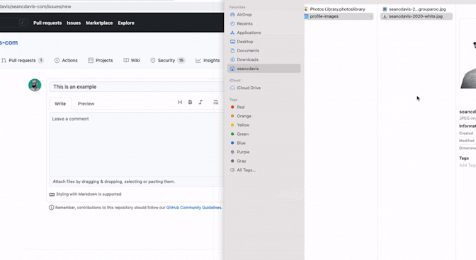

# [Process Writeups Video](https://www.youtube.com/watch?v=AdEKspenOmU)

# Bookmark this page!
* This is a living document. It is subject to change. But you'll want to be able to come back to find it.

## What is a writeup
* **For YOU**: A place to process what you're learning WHILE you're learning it
  * "I already understand this" 
    * Processing will help you understand it deeper AND help solidify the short-term into long-term understanding. If it feels like busywork, you're doing it wrong. 
  * "I kind of understand this."
    * You are in the sweet spot. Processing will REALLY help you understand this.
  * "I don't understand this at all" 
    * You MUST ask for help, THEN process! Otherwise you will fall behind
  * Still confused: get unstuck! Slack, tutoring, jsbin
* **For TEACHER**: A sneak peek into your brain

## How to do a writeup
* Context
* Organization is up to you
  * Rich task(s)/concept(s) with challenges/takeaways throughout
    * Concept by concept
    * Challenge by challenge
  * A narrative of the topic, with challenges/takeaways at the end
* Summary/Takeaways should be specific
  * Content-based, i.e.
> I learned how to make a clickable link using ``
*
  * Skills-based, i.e.
> It's important to ask for help. I asked ___ for help about ___ and they ___ and so I ___

## Editing your writeup
* [Template](template.md)
  * Starter code can/should be deleted when you don't need it
* github.com using the pencil icon
  * Does NOT auto-save! Must commit.
* github.dev
  * Great for side-by-side preview (magnifying glass icon )
  * source control icon > enter message > commit & push
  * Menu > go to repository
* IDE
  * If you know what this is, you can clone your repo into your IDE
* How to find your writeups later
  * All of your repos created in Github Classroom (including writeups) can be found at [github.com/hstatsep-students](http://github.com/hstatsep-students)
 
## Requirements/Rubric
* [requirements.md](requirements.md)
 
## Examples
* [Example 1](example-mueller-java-ll.md)
* [Example 2](example-mueller-python-recursion.md)
* [Student snippets](student-snippets.md)
  * These are parts of student writeups

### How to add an image to a writeup
* If using the Github.com editor, just drag and drop:

* If using an IDE, you can either:
  * Upload via your IDE
  * Upload via the Github.com interface, then pull into your IDE
 
### Submitting your writeup
* NOTE: when you submit on Google Classroom, it tries to load a preview. But since the URL is private, it will say "404 page not found." This is normal!
